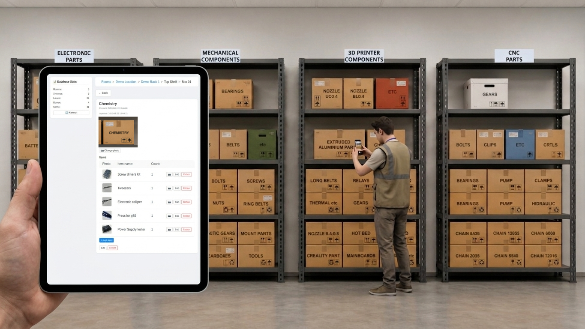

# Warehouse

Read the [Documentation](https://michaelfedorchenko.github.io/warehouse/)

    <picture>
        
    </picture>

### The Last Releases (18 aug 2026)

    

    

## About Application
Warehouse is an application designed for tracking and rapidly locating items within workshops, laboratories, garages, or warehouses.

The software enables users to replicate the physical structure of any storage space, including rooms, racks, shelves, boxes, and individual items. It supports adding names, quantities, descriptions, and photographs to both boxes and items, streamlining the retrieval process and eliminating time-consuming manual searches.

The application ensures that stored items are organized precisely as they are arranged on physical shelves. Database population is optimized for maximum efficiency: activating the built-in web server generates a QR code, which can be scanned with a mobile device. This action opens a mobile web interface for seamlessly adding locations (rooms), racks, boxes, and their contents. Once saved, all items can be rearranged within the Warehouse Desktop Application via drag-and-drop to perfectly mirror the real-world storage setup.

To facilitate collaborative teamwork, a dedicated Warehouse Standalone Server package can be deployed, which also features an open API for seamless integration with external systems. Alternatively, the Warehouse Desktop Application itself supports team collaboration through a Master/Slave architecture. In this setup, one instance of the application runs in Master mode to host the database, while other instances operate as Slaves and connect to it over the local network via an IP address and port.

## Interface Languages
* German
* English
* Spanish
* French
* Italian
* Polish
* Ukrainian

## Donate
If you find the application useful, you can support the project with a donation: <a target='_blank' href='https://www.paypal.com/donate/?hosted_button_id=RUM6J38PN3FE4'>Donate PayPal</a>
