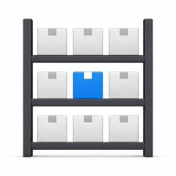
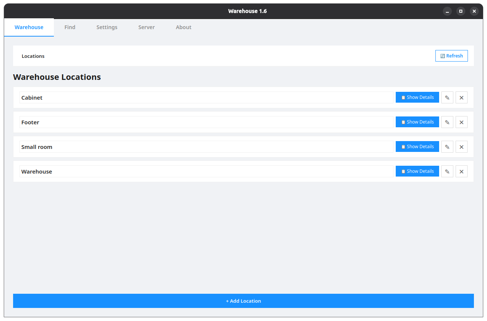
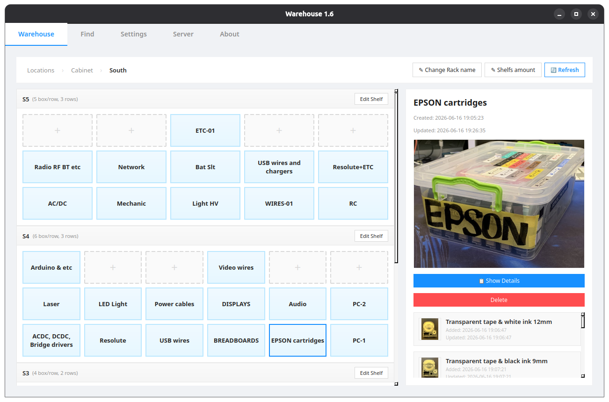
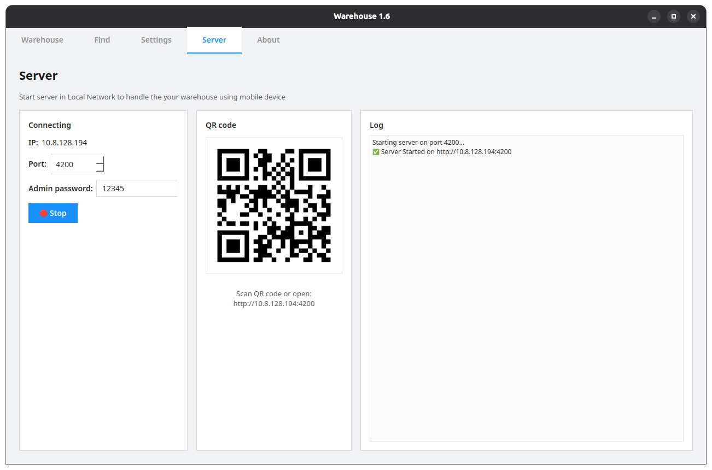
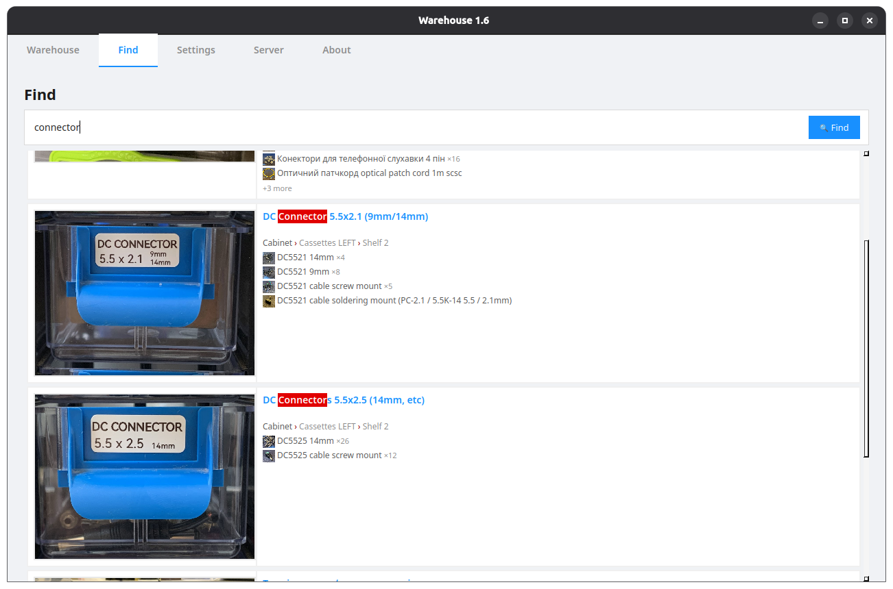
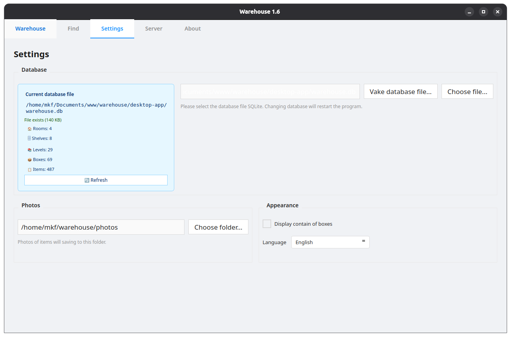
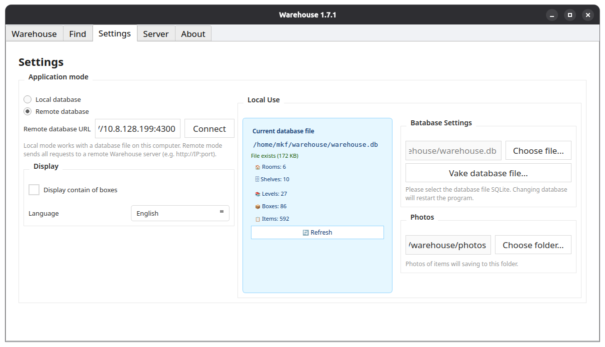

<h1>Warehouse</h1>

 

<h3>Released new version: 18 aug 2026</h3>

    

    

## About Application
**Warehouse** is an application for keeping track of items and quickly finding them in a workshop, laboratory, garage, or warehouse.

It allows you to describe the real structure of your storage space: rooms, racks, shelves, boxes, and the items inside them.
You can add names, quantities, descriptions, and photos to boxes and items, making it easy to find what you need without long searches.

The application was created from a personal need to bring order to a small laboratory and was inspired by Adam Savage’s approach to workshop organization — where every item has its place, and order helps you work faster and more efficiently.

    
    

## How It Works

    

The application allows you to organize and store items exactly as they are arranged on your physical shelves. Populating the database is designed to be as convenient as possible: simply enable the web server on the corresponding tab and scan the QR code with your mobile device. This opens a web interface on your device where you can easily add locations (rooms), racks, boxes, and their contents. Once saved, everything can be rearranged within the app to mirror your real-world shelves.

    

The **Move** feature provides a seamless way to relocate boxes between shelves and rooms, as well as transfer individual items from one box to another.

The **Search** feature (located in the Search tab) instantly finds the item you need, shows its exact storage location, and saves you time looking for it.

## SQLite Database

    

Screenshot of Warehouse v1.6

    

Screenshot of Warehouse v1.7.1 - added remote server with database

The application allows you to switch between different database files, enabling you to logically separate multiple distinct storage locations.

## Interface Languages
* German
* English
* Spanish
* French
* Italian
* Polish
* Ukrainian

## Donate
If you find the application useful, you can support the project with a donation: <a target='_blank' href='https://www.paypal.com/donate/?hosted_button_id=RUM6J38PN3FE4'>Donate PayPal</a>
